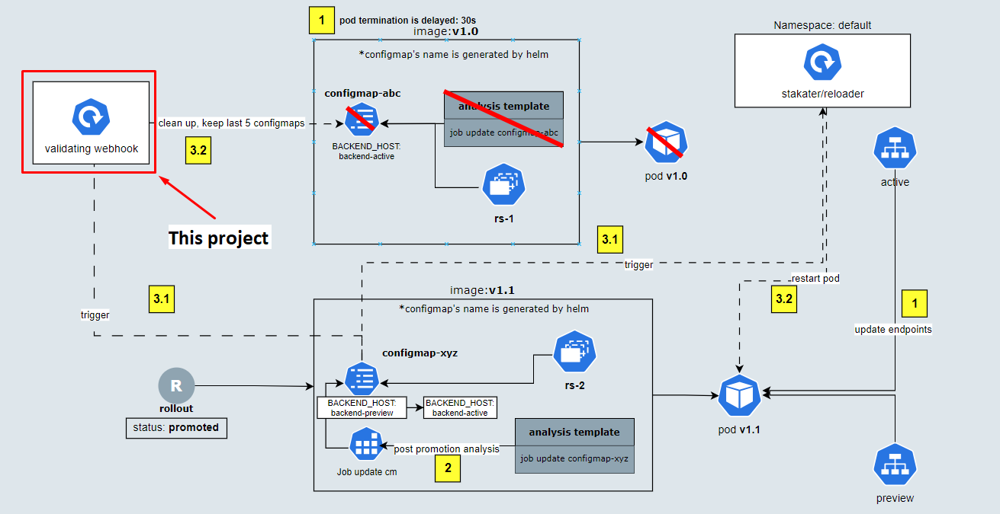

# blue-green-webhook

- This project implements webhook to clean up resources (job, pod, configmap) that will be created by argocd webhook when using dynamic configmap for legacy blue/green deployment strategy.

- Whenever a configmap has: annotations `"ftech.rollouts.promoted" == "false"` and `"ftech.rollouts.promoted"` not null, label `"ftech.rollouts.configmaps" == "true"`, is updated:
1. Delete all pods created by job in blue-green rollouts app by `ftech.rollouts.app` label
2. Delete all jobs and its resource in blue-green rollouts app except 5 latest created jobs by `ftech.rollouts.app` label

